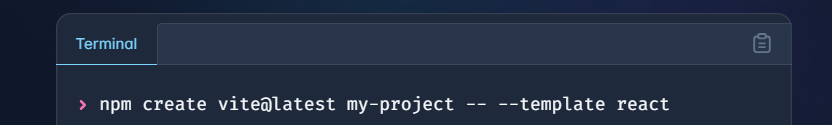
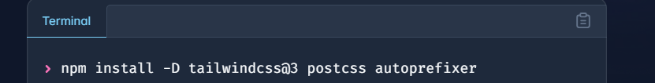
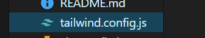
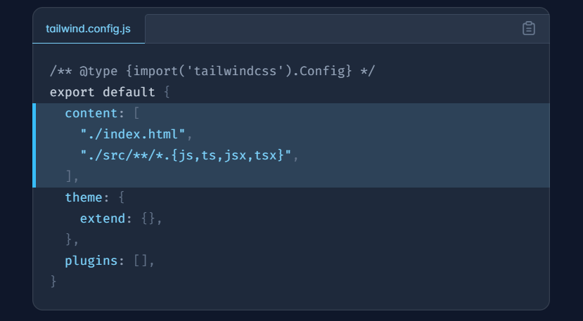
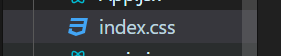
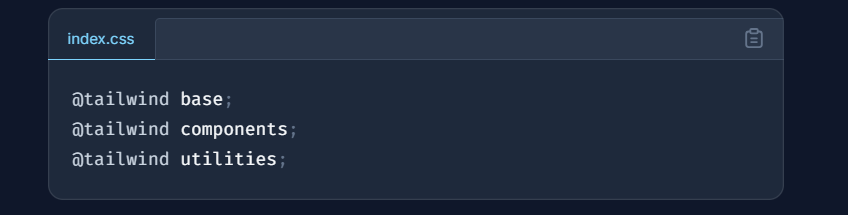

## MY-PORTFOLIO

1. istall react (npm create vite@latest my-project -- --template react)

2. install tailwind (npm install -D tailwindcss@3 postcss autoprefixer)

3. install tailwind confige (npx tailwindcss init -p)

4. change into indexcss

5. Let's start to open localhost:5173 (npm run dev)
6. install (npm install framer-motion)
7. install (npm install react-icons --save)

## Components

- Contact
- Hero
- Navbar
- Projects
- Tech
